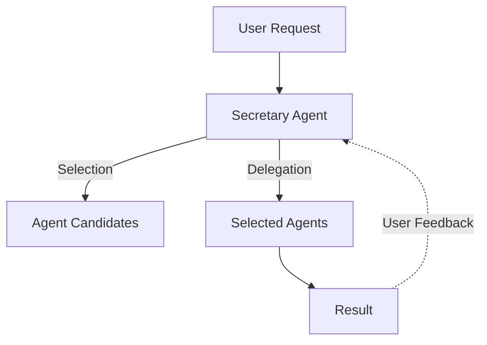

# FastSlug - An Extensible AI Agent System
FastSlug is an extensible AI agent platform that intelligently selects and coordinates specialized AI agents to handle users' requests.

*Figure: Overview of the FastSlug agent selection and coordination process.*