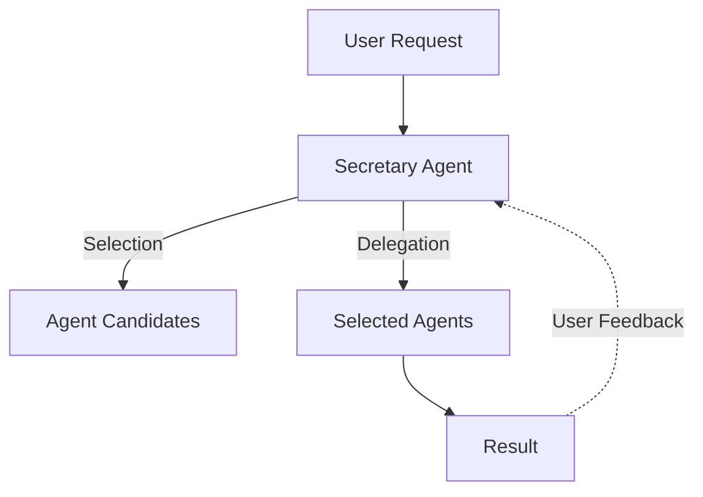

## FastSlug - An Extensible AI Agent System
FastSlug is an extensible AI agent platform that intelligently selects and coordinates specialized AI agents to handle users' requests.



*Figure: Overview of the FastSlug agent selection and coordination process.*


## Install

**To install from PyPI(once available), run:**

```bash
   pip install fastslug
```

## Setup

1. **Set your OpenAI API key**:

```bash
   export OPENAI_API_KEY='your-openai-api-key'
```

## Commands

To view all available commands, run:
```bash
   fastslug --help
```